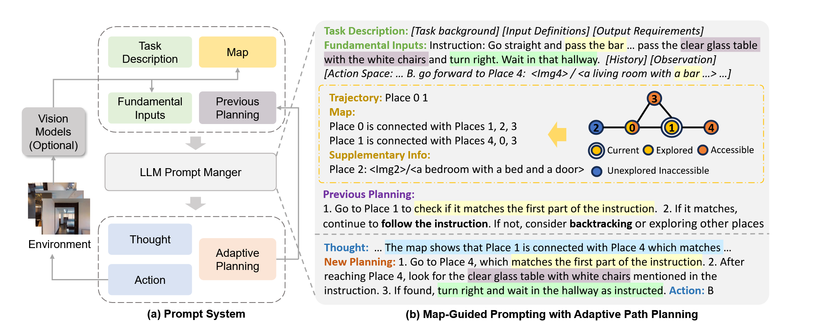
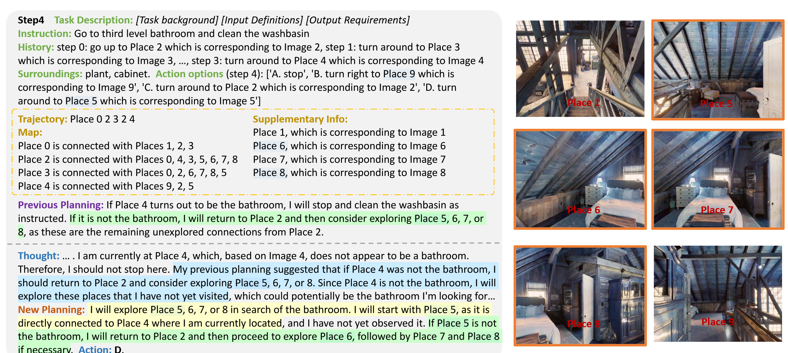

# MapGPT



#### Visual Observation:

只使用包含navigable point的图像，处理图像有两种办法，一种是和navgpt一样的two-stage system，既抽特征又送入bert生成描述，和navgpt一样，还有一种是one-stage system，直接把原始图片送到gpt里面。

这里只使用包含navigable point的图像就意味着，输给gpt的信息就只有包含navigable point的图像，其他无关图像直接丢弃不用。

#### action space：

stop+跳转到所有邻近的可观测到的navigable point

#### point category：

(1) explored nodes {enj }t  j=0 (including starting node en0 and current  node ent),

(2) accessible nodes {ant0, ant1, ...}, and 

(3) unexplored inaccessible nodes {un0, un1, ...}.

#### Map：

```
“Map: 
Place {en0} is connected with Places {an00}, ...  
Place {en1} is connected with Places {an01}, ... 
...  
Place {ent} is connected with Places {ant0}, ...”,
```

使用如上语言描述图

#### supplementary info:

记录目前不可到达且之前没探索过的地方的图像信息




***


#### Matterport Simulator：


```c++
        /**
         * Set a non-standard path to the viewpoint connectivity graphs. The provided directory must contain files
         * of the form "/<scanId>_connectivity.json". Default is "./connectivity" (the graphs provided
         * by this repo).
         */
        void setNavGraphPath(const std::string& path);
```

可以通过

```
sim.setNavGraphPath(connectivity_dir)
```

自定义连通图。

这里展示一个连通图文件

```json
[

{
    // image_id应该是连通图上每个点的id
    "image_id":"10c252c90fa24ef3b698c6f54d984c5c",
	"pose":[-0.934268,-0.00147015,-0.35657,-5.48891,0.356526,-0.0200643,-0.93407,1.4484,-0.00578122,-0.999798,0.0192692,1.53509,0,0,0,1],
	"included":true,
	"visible":[false,false,true,false,false,false,false,false,true,false,false,false,true,false,true,true,false,true,true,false,false,false,false,true,false,false,false,false,false,true,true,true,false,false,false,false,true,false,false,false,false,false,false,false,false,false,true,false],
	"unobstructed":[false,false,false,false,false,false,false,false,false,false,false,false,true,false,false,false,false,false,true,false,false,false,false,true,false,false,false,false,false,false,false,false,false,false,false,false,false,false,false,false,false,false,false,false,false,false,false,false],
	"height":1.5357383388956596
},

...

]
```


```
        /**
         * Set a non-standard path to the <a href="https://niessner.github.io/Matterport/">Matterport3D dataset</a>.
         * The provided directory must contain subdirectories of the form:
         * "<scanId>/matterport_skybox_images/". Default is "./data/v1/scans/".
         */
        void setDatasetPath(const std::string& path);
```

Matterport3D图像数据并没有包含在其中，需要单独下载。


simulator api:[peteanderson80/Matterport3DSimulator: AI Research Platform for Reinforcement Learning from Real Panoramic Images.](https://github.com/peteanderson80/Matterport3DSimulator?tab=readme-ov-file#simulator-api)

By default, only camera viewpoints that are within the agent's current field of view are considered navigable, unless restricted navigation is turned off (i.e., the agent can't move backwards, for example).

```json
[
  {
    "scanId" : "2t7WUuJeko7"  // Which building the agent is in
    "step" : 5,               // Number of frames since the last newEpisode() call
    "rgb" : <image>,          // 8 bit image (in BGR channel order), access with np.array(rgb, copy=False)
    "depth" : <image>,        // 16 bit single-channel image containing the pixel's distance in the z-direction from the camera center 
                              // (not the euclidean distance from the camera center), 0.25 mm per value (divide by 4000 to get meters). 
                              // A zero value denotes 'no reading'. Access with np.array(depth, copy=False)
    "location" : {            // The agent's current 3D location
        "viewpointId" : "1e6b606b44df4a6086c0f97e826d4d15",  // Viewpoint identifier
        "ix" : 5,                                            // Viewpoint index, used by simulator
        "x" : 3.59775996208,                                 // 3D position in world coordinates
        "y" : -0.837355971336,
        "z" : 1.68884003162,
        "rel_heading" : 0,                                   // Robot relative coords to this location
        "rel_elevation" : 0,
        "rel_distance" : 0
    }
    "heading" : 3.141592,     // Agent's current camera heading in radians
    "elevation" : 0,          // Agent's current camera elevation in radians
    "viewIndex" : 0,          // Index of the agent's current viewing angle [0-35] (only valid with discretized viewing angles)
                              // [0-11] is looking down, [12-23] is looking at horizon, is [24-35] looking up
    "navigableLocations": [   // List of viewpoints you can move to. Index 0 is always the current viewpoint, i.e. don't move.
        {                     // The remaining valid viewpoints are sorted by their angular distance from the image centre.
            "viewpointId" : "1e6b606b44df4a6086c0f97e826d4d15",  // Viewpoint identifier
            "ix" : 5,                                            // Viewpoint index, used by simulator
            "x" : 3.59775996208,                                 // 3D position in world coordinates
            "y" : -0.837355971336,
            "z" : 1.68884003162,
            "rel_heading" : 0,                                   // Robot relative coords to this location
            "rel_elevation" : 0,
            "rel_distance" : 0
        },
        {
            "viewpointId" : "1e3a672fa1d24d668866455162e5b58a",  // Viewpoint identifier
            "ix" : 14,                                           // Viewpoint index, used by simulator
            "x" : 4.03619003296,                                 // 3D position in world coordinates
            "y" : 1.11550998688,
            "z" : 1.65892004967,
            "rel_heading" : 0.220844170027,                      // Robot relative coords to this location
            "rel_elevation" : -0.0149478448723,
            "rel_distance" : 2.00169944763
        },
        {...}
    ]
  }
]
```


#### code analysis：

首先，实例化一个R2RNavBatch对象，存放在val_env中。

```
val_envs = {}
split = args.split = MapGPT_72_scenes_processed
val_envs[split] = val_env
```

MapGPT_72_scenes_processed.json保存了每条轨迹数据，而且是预处理过的数据

```json
[

{"distance": 11.66, "scan": "VLzqgDo317F", "path_id": 6250, "path": ["af3af33b0120469c9a00daa0d0b36799", "5be145994f974347850a48cecd04cdcd", "79aedad1206b4eea9c4b639ea2182eb7", "1c91ed40af2246f2b126dd0f661970df", "385019f5d018430fa233d483b253076c", "fd263d778b534f798d0e1ae48886e5f3"], "heading": 3.751, "instr_id": "6250_2", "instruction": "walk forward then turn right at the stairs then go down the stairs."}, 

{"distance": 6.64, "scan": "sT4fr6TAbpF", "path_id": 3414, "path": ["9d001c6bc0f64a699fd36a6b9a61266a", "8138835f78064c28b6c9c35a89eda7d6", "37a978a1cc0e4464a714fb676f65b7fb", "859a7c9c12c847d9a6860bd6d6bd635a", "c3c5e202b9a04a63ae33742fe9095936", "c06aae190b804b759496db0b88fe4820"], "heading": 4.714, "instr_id": "3414_1", "instruction": "Head straight until you pass the wall with holes in it the turn left and wait by the glass table with the white chairs."},

...

]
```

这些数据被保存在R2RNavBatch.data中

R2RNavBatch.env保存EnvBatch的实例对象，而在EnvBatch中

EnvBatch.sims 以列表形式储存了批量大小个MatterSim.Simulator()

并且设置了vfov=60，以及

```python
if scan_data_dir:
    sim.setDatasetPath(scan_data_dir)
sim.setNavGraphPath(connectivity_dir)
sim.setRenderingEnabled(False)
sim.setDiscretizedViewingAngles(True)   # Set increment/decrement to 30 degree. (otherwise by radians)
```

但是scan_data_dir为空

```python
  args.scan_data_dir = os.path.join(ROOTDIR, 'Matterport3D', 'v1_unzip_scans')
```


R2RNavBatch.gt_trajs定义如下

```python
self.gt_trajs = self._get_r2r_gt_trajs(self.data) # for evaluation

    def _get_r2r_gt_trajs(self, data):
        gt_trajs = {
            x['instr_id']: (x['scan'], x['path']) \
                for x in data if len(x['path']) > 1
        }
        return gt_trajs
```

R2RNavBatch.ix = 0，保存目前数据评估到哪里了

R2RNavBatch.graphs={scanid:G}存放图的信息

R2RNavBatch.sim又新建了一个配置相同的sim

R2RNavBatch.buffered_state_dict = {}


接下来实例化GPTNavAgent对象，储存在agent中

GPTNavAgent.env=R2RNavBatch

GPTNavAgent.prompt_manager = OneStagePromptManager(self.args)

GPTNavAgent.logs = defaultdict(list)


接下来进入主函数agent.test(args=args)

agent.results = {}

进入rollout

进入R2RNavBatch的reset 

R2RNavBatch.batch保存一个批量大小的数据

self.sims[i].newEpisode([scanId], [viewpointId], [heading], [0])初始化episode

最后R2RNavBatch._get_obs()返回observations

在R2RNavBatch._get_obs()中，首先要调用self.make_candidate(state.scanId, state.location.viewpointId, state.viewIndex)获得周围点的信息

进入make_candidate中

```python
for ix in range(36):
    if ix == 0:
        self.sim.newEpisode([scanId], [viewpointId], [0], [math.radians(-30)])
    elif ix % 12 == 0:
        self.sim.makeAction([0], [1.0], [1.0])
    else:
        self.sim.makeAction([0], [1.0], [0])
```

使用另外一个单独获取周围点的sim，对周围扫36次，获取周围点的各种信息，包括周围点的图像。

将周围点信息保存在R2RNavBatch.buffered_state_dict[long_id]中，下次访问相同点时就可直接使用。

返回周围点信息列表，make_candidate结束。

_get_obs返回所有观察结果，不包括自己当前视角下的图像信息。

R2RNavBatch的reset 结束

继续rollout

```python
        # Record the navigation path
        traj = [{
            'instr_id': ob['instr_id'],
            'path': [[ob['viewpoint']]],
            'details': {},
            'a_t': {},
        } for ob in obs]
```

下面开始构造prompt

```python
            cand_inputs = self.prompt_manager.make_action_prompt(obs, previous_angle)
            if self.args.response_format == 'str':
                nav_input = self.prompt_manager.make_r2r_prompts(cand_inputs=cand_inputs, obs=obs, t=t)
            elif self.args.response_format == 'json':
                nav_input = self.prompt_manager.make_r2r_json_prompts(cand_inputs=cand_inputs, obs=obs, t=t)
            else:
                raise NotImplemented
```

到这里都实现批量，后面只将第一个批量取出送入llm预测动作

用正则式取出动作，执行动作

最后更新history

```python
self.prompt_manager.make_history(a_t, nav_input, t)
```


#### 总结

1. in [MapGPT/GPT/one_stage_prompt_manager.py at main · chen-judge/MapGPT](https://github.com/chen-judge/MapGPT/blob/main/GPT/one_stage_prompt_manager.py) line67

```python
direction = self.get_action_concept(cc['absolute_heading'] - previous_angle[i]['heading'],cc['absolute_elevation'] - 0)
```

​	解答：因为所有的elevation都为0

2. 用别人视角里包含路径点的一张图概括路径点的特征，是否有些片面。个人感觉可以在后续采到同一路径点不同视角下的图像时，也可以保留之前图片，一起作为该路径点的特征。
3. ce中路径点会改变，如何构造一个和离散相似的map：参考ETPNav
4. 

```
--img_root /path/to/images
img_path = os.path.join(self.args.img_root, scanId, viewpointId, str(ix) + '.jpg')
```

--img_root用来存放图像[RGB_Observations.zip](https://connecthkuhk-my.sharepoint.com/:f:/g/personal/jadge_connect_hku_hk/Eq00RV04jXpNkwqowKh5mYABBTqBG1U2RXgQ7FvaGweJOQ?e=rL1d6p) 

issue解答：

Please follow this and --img_root should be the path to your images:
"The observation images need to be collected in advance from the simulator. You can use your own saved images or use the [RGB_Observations.zip](https://connecthkuhk-my.sharepoint.com/:f:/g/personal/jadge_connect_hku_hk/Eq00RV04jXpNkwqowKh5mYABBTqBG1U2RXgQ7FvaGweJOQ?e=rL1d6p) we have processed."


#### 疑问

```python
if scan_data_dir:
    sim.setDatasetPath(scan_data_dir)
args.scan_data_dir = os.path.join(ROOTDIR, 'Matterport3D', 'v1_unzip_scans')
```

但是scan_data_dir为空，还是说里面应该放[RGB_Observations.zip](https://connecthkuhk-my.sharepoint.com/:f:/g/personal/jadge_connect_hku_hk/Eq00RV04jXpNkwqowKh5mYABBTqBG1U2RXgQ7FvaGweJOQ?e=rL1d6p) ？

```c++
        /**
         * Set a non-standard path to the <a href="https://niessner.github.io/Matterport/">Matterport3D dataset</a>.
         * The provided directory must contain subdirectories of the form:
         * "<scanId>/matterport_skybox_images/". Default is "./data/v1/scans/".
         */
        void setDatasetPath(const std::string& path);
```


#### 移植改动：

1. 将ce数据集以类似MapGPT_72_scenes_processed.json的形式传入
1. 如何将habitat simulator输出的图像送到gpt中
1. ~~sim.setNavGraphPath(connectivity_dir)中的连通图~~
1. 得到ce中的shortest_distances


#### 研究connectivity_dir下的连通图的作用

```python
class R2RNavBatch(object):
    def __init__()
        self._load_nav_graphs()

    def _load_nav_graphs(self):
        """
        load graph from self.scan,
        Store the graph {scan_id: graph} in self.graphs
        Store the shortest path {scan_id: {view_id_x: {view_id_y: [path]} } } in self.paths
        Store the distances in self.distances. (Structure see above)
        Load connectivity graph for each scan, useful for reasoning about shortest paths
        :return: None
        """
        print('Loading navigation graphs for %d scans' % len(self.scans))
        self.graphs = load_nav_graphs(self.connectivity_dir, self.scans)
        
        #事实上，self.shortest_paths根本没有用在其他地方
        self.shortest_paths = {}
        for scan, G in self.graphs.items():  # compute all shortest paths
            self.shortest_paths[scan] = dict(nx.all_pairs_dijkstra_path(G))
            
            
        self.shortest_distances = {}
        for scan, G in self.graphs.items():  # compute all shortest paths
            self.shortest_distances[scan] = dict(nx.all_pairs_dijkstra_path_length(G))
```

```python
def load_nav_graphs(connectivity_dir, scans):
    ''' Load connectivity graph for each scan '''

    def distance(pose1, pose2):
        ''' Euclidean distance between two graph poses '''
        return ((pose1['pose'][3]-pose2['pose'][3])**2\
          + (pose1['pose'][7]-pose2['pose'][7])**2\
          + (pose1['pose'][11]-pose2['pose'][11])**2)**0.5

    graphs = {}
    for scan in scans:
        with open(os.path.join(connectivity_dir, '%s_connectivity.json' % scan)) as f:
            G = nx.Graph()
            positions = {}
            data = json.load(f)
            for i,item in enumerate(data):
                if item['included']:
                    for j,conn in enumerate(item['unobstructed']):
                        if conn and data[j]['included']:
                            positions[item['image_id']] = np.array([item['pose'][3],
                                    item['pose'][7], item['pose'][11]]);
                            assert data[j]['unobstructed'][i], 'Graph should be undirected'
                            G.add_edge(item['image_id'],data[j]['image_id'],weight=distance(item,data[j]))
            nx.set_node_attributes(G, values=positions, name='position')
            graphs[scan] = G
    return graphs
```

事实上，只有R2RNavBatch.shortest_distances在后续的过程中被用到，它被加入到了_get_obs函数的返回结果中。

```python
            # RL reward. The negative distance between the state and the final state
            # There are multiple gt end viewpoints on REVERIE. 
            if ob['instr_id'] in self.gt_trajs:
                ob['distance'] = self.shortest_distances[ob['scan']][ob['viewpoint']][item['path'][-1]]
            else:
                ob['distance'] = 0
```

pyshortest_distances可以作为RL的评估指标，以及在evaluation阶段中使用。

ce中可以得到shortest_distances吗？
