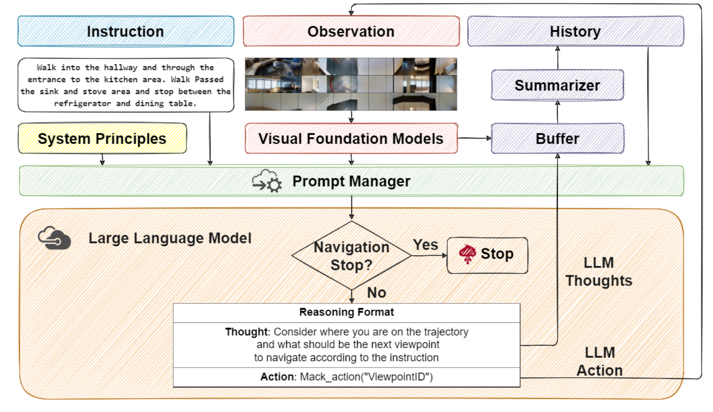
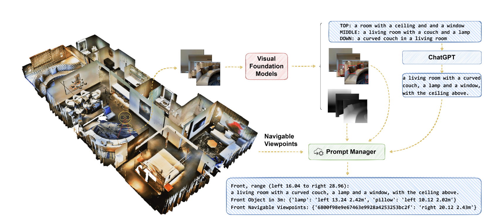
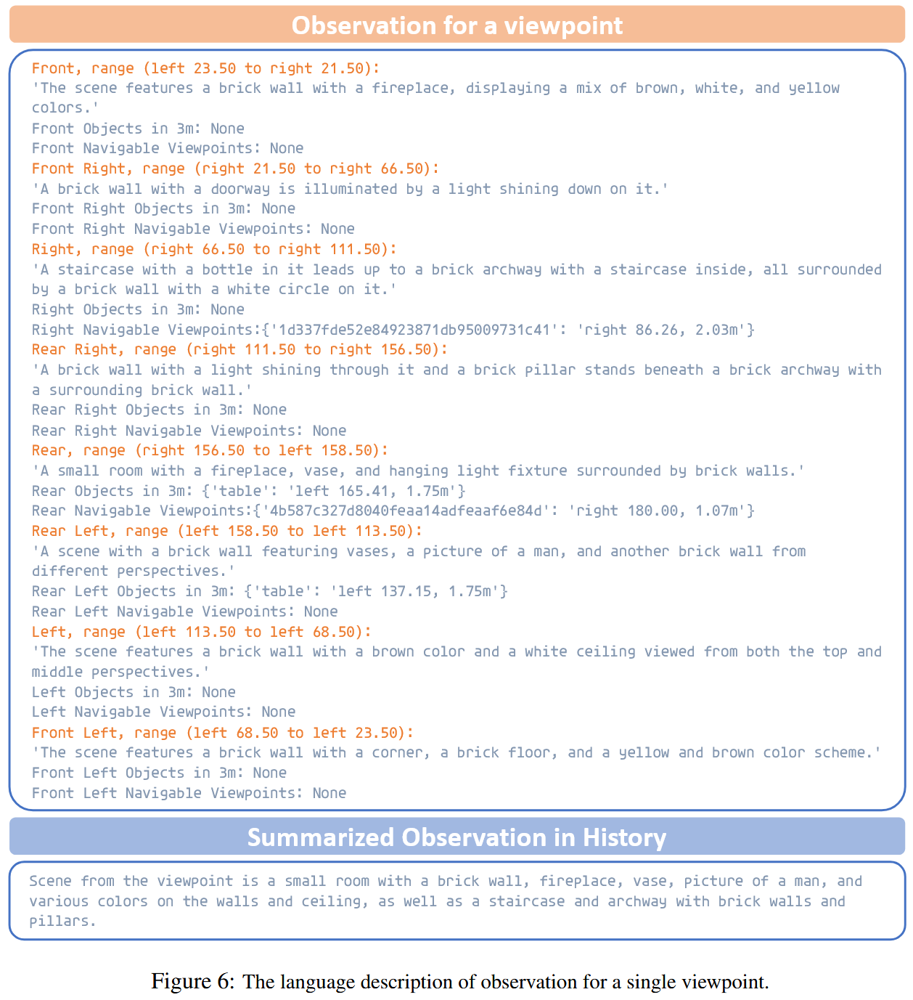

# NavGPT

离散vln

action space：所有navigable points+stop

#### Visual Foundation Models

全景图包含8*3张图，8种heading，3种elevation，heading无重叠，elevation有15°重叠

1. 对同一heading下的三张不同elevation的图片，使用BLIP-2生成自然语言描述每张图片，并使用GPT-3.5 summarizer总结。

2. 使用Fast-RCNN识别图片里不同物品，生成相应的bounding box，并通过和simulator交互得到中心点像素的深度信息。只保留离agent在3m之内的物品信息。这些信息后续会被prompt manager处理成自然语言。
3. agent和simulator交互得到深度信息以及navigable viewpoints
4. prompt manager将agent目前的heading作为front direction，计算agent与识别出的物品之间的相对角度，以及agent与navigable viewpoints之间的相对角度
5. 将每个heading的自然语言描述按顺时针连接起来

