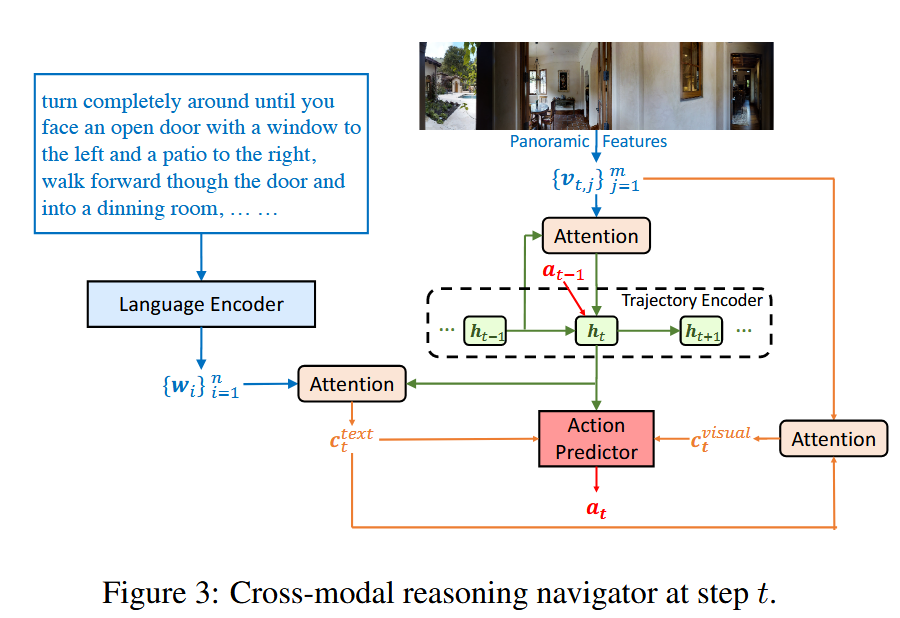
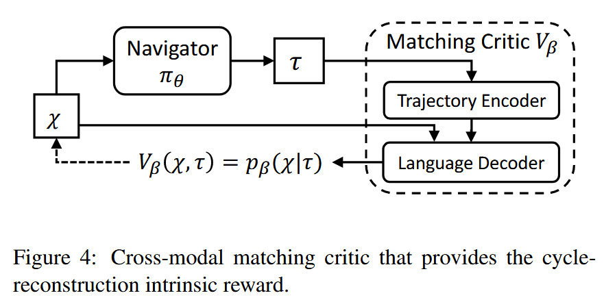

### Reinforced Cross-Modal Matching and Self-Supervised Imitation Learning  for Vision-Language Navigation

加入了RL方法的discrete vln

#### Reinforced Cross-Modal Matching

The RCM framework mainly consists of two modules： a reasoning navigator πθ and a matching critic Vβ.

1.Cross-Modal Reasoning Navigator

注意，此模型在每个离散点上观察到的是全景图。

简单来说，就是attention+LSTM套了好几个

2.Cross-Modal Matching Critic

一个预训练好的用来得到intrinsic reward的模组

它会计算出（根据navigator目前的trajectory能反推出原language instruction）的概率，并根据此概率大小判断目前trajectory的好坏，并最终得到intrinsic reward。

#### 训练过程

训练分为两步

1.第一步是热启动过程，旨在迅速初始化agent的策略。热启动为监督学习，使用交叉熵损失。

2.第二步就是正式训练了，使用RL的方法，reward包括extrinsic and intrinsic reward。intrinsic reward使用上面介绍过的Cross-Modal Matching Critic计算得出，下面介绍extrinsic reward：

extrinsic reward也包括两部分，一是评估action使得agent靠近目标点的距离，二是评估action是否使得agent成功到达目标点周围。

最后，使用RL的REINFORCE算法，梯度下降得到最优策略。

#### Self-Supervised Imitation Learning

上述模型和训练都是基于已有数据，下面的模型将使得agent在没有数据的情况下自由探索unseen environment，并进行策略优化

SIL借用了上述Matching Critic模型。给定language instruction，agent先生成一组possible trajectories，然后由Matching Critic模型进行评估，筛选出最优的trajectory。接下来，这个最优的trajectory就被视为之前supervised learning的ground-truth trajectory，可以使用之前热启动的方法优化策略。

总结：

这篇文章实际上用了两种方法训练agent：

一种是在热启动和Self-Supervised Imitation Learning里面，使用了交叉熵损失训练

另一种是RL中的policy gradient方法，也就是REINFORCE

相同点在于，两者都使用了一样的策略函数

