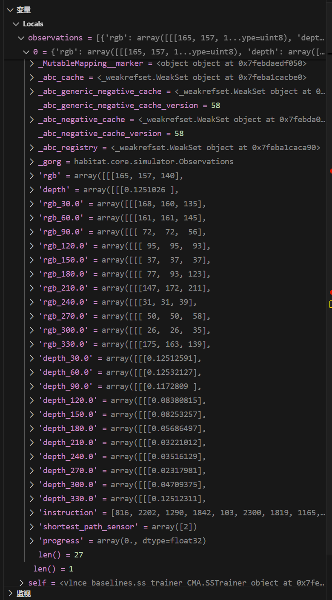
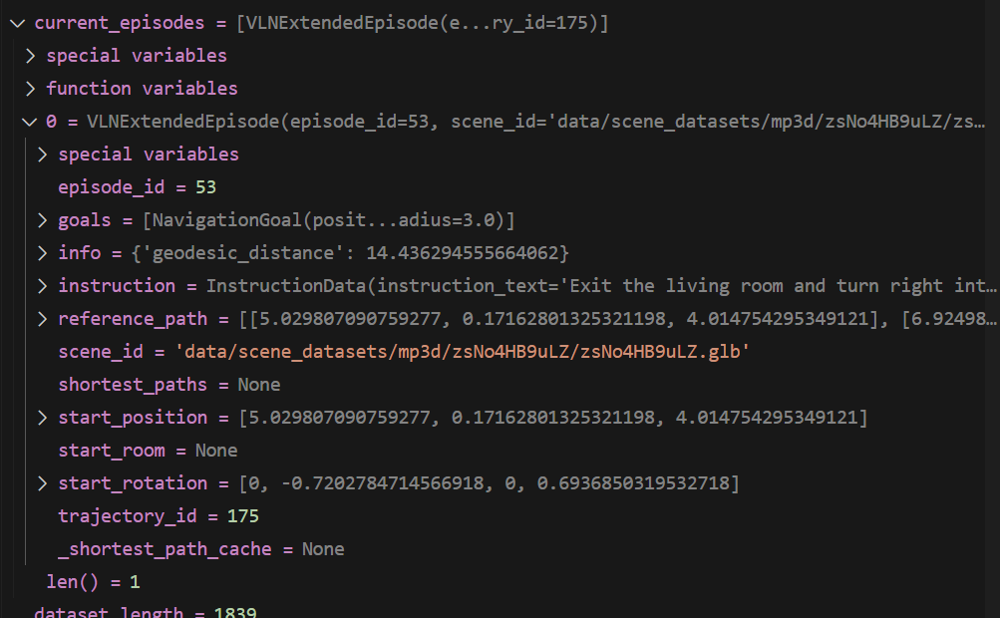
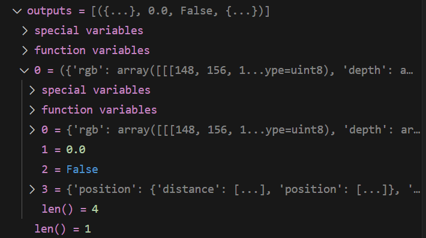
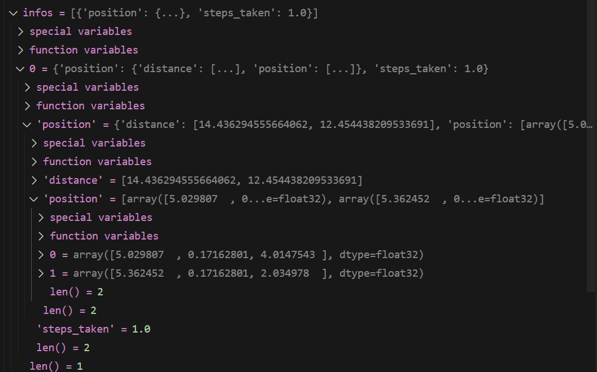

# dcvln code analysis


TRAINER_NAME: schedulesampler-CMA

```
    trainer_init = baseline_registry.get_trainer(config.TRAINER_NAME)
    assert trainer_init is not None, f"{config.TRAINER_NAME} is not supported"
    trainer = trainer_init(config)
```


in vlnce_baselines/common/env_utils.py:

```
class BaseVLNCETrainer(BaseILTrainer):
    r"""A base trainer for VLN-CE imitation learning."""
```

```
    def _eval_checkpoint(
        self,
        checkpoint_path: str,
        writer: TensorboardWriter,
        checkpoint_index: int = 0,
    ) -> None:
        r"""Evaluates a single checkpoint.

        Args:
            checkpoint_path: path of checkpoint
            writer: tensorboard writer object
            checkpoint_index: index of the current checkpoint

        Returns:
            None
        """
```


build envs，得到VLNCEDaggerEnv的环境类

```
        # config.ENV_NAME='VLNCEDaggerEnv'
        envs = construct_envs(
            config, get_env_class(config.ENV_NAME),
            auto_reset_done=False,
            episodes_allowed=self.traj
        )
```


> init dataset:
>
> in vlnce_baselines/common/env_utils.py line66
>
> ```
> #config.TASK_CONFIG.DATASET.TYPE='VLN-CE-v1'
> dataset = make_dataset(config.TASK_CONFIG.DATASET.TYPE)
> ```
>
> > 
> >
> > ```
> > _dataset = registry.get_dataset(id_dataset)
> > #调用init部分初始化
> > return _dataset(**kwargs)  
> > ```
> >
> > 
> >
> > def dataset"VLN-CE-v1":
> >
> > in habitat_extensions/task.py
> >
> > ```
> > @registry.register_dataset(name="VLN-CE-v1")
> > class VLNCEDatasetV1(Dataset):
> >  r"""Class inherited from Dataset that loads a Vision and Language
> >  Navigation dataset.
> >  """
> > ```
> >
> > 
>
> continued init dataset:
>
> in vlnce_baselines/common/env_utils.py line66
>
> scenes记录所有场景的id
>
> ```
> scenes = dataset.get_scenes_to_load(config.TASK_CONFIG.DATASET)
> ```
>
> 1
>
> ```
>     @classmethod
>     def get_scenes_to_load(cls, config: Config) -> List[str]:
>         r"""Return a sorted list of scenes"""
>         assert cls.check_config_paths_exist(config)
>         dataset = cls(config)
>         return sorted(
>             {cls._scene_from_episode(episode) for episode in dataset.episodes}
>         )
> ```
>
> dataset = cls(config)构造数据集
>
> scenes根据num_envs的个数切分成scene_splits
>
> ```
> scene_splits=[['2azQ1b91cZZ', '8194nk5LbLH', 'EU6Fwq7SyZv', 'QUCTc6BB5sX', 'TbHJrupSAjP', 'X7HyMhZNoso', 'Z6MFQCViBuw', 'oLBMNvg9in8', 'pLe4wQe7qrG', ...]]
> ```
>
> 1
>
> ```
> # created inside habitat library
> 	envs = habitat.VectorEnv(
>      make_env_fn=make_env_fn,
>      env_fn_args=tuple(zip(configs, env_classes)),
>      auto_reset_done=auto_reset_done,
>      workers_ignore_signals=workers_ignore_signals,
>  )
> ```


initialize policy:

```
	 	self._initialize_policy(
            config,
            load_from_ckpt=True,
            observation_space=observation_space,
            action_space=envs.action_spaces[0],
        )
```

> 
>
> ```
> 		# self.config.MODEL.policy_name='PolicyViewSelectionCMA'
> 		policy = baseline_registry.get_policy(self.config.MODEL.policy_name)
>      	self.policy = policy.from_config(
>          config=config,
>          observation_space=observation_space,
>          action_space=action_space,
>      )
> ```
>
> initialize net
>
> ```
> class CMANet(Net):
>  r"""A cross-modal attention (CMA) network that contains:
>  Instruction encoder
>  Depth encoder
>  RGB encoder
>  CMA state encoder
>  """
> ```
>
> initialize the waypoint predictor here
>
> ```
>      self.waypoint_predictor = BinaryDistPredictor_TRM(device=self.device)
>      self.waypoint_predictor.load_state_dict(
>          torch.load(
>              './waypoint_prediction/checkpoints/check_val_best_avg_wayscore',
>              map_location = torch.device('cpu'),
>          )['predictor']['state_dict']
>      )
> ```
>
> 

generate observation

```
        observations = envs.reset()
        observations = extract_instruction_tokens(
            observations, self.config.TASK_CONFIG.TASK.INSTRUCTION_SENSOR_UUID
        )
        batch = batch_obs(observations, self.device)
        batch = apply_obs_transforms_batch(batch, obs_transforms)
```


```
observations = extract_instruction_tokens(
            observations, self.config.TASK_CONFIG.TASK.INSTRUCTION_SENSOR_UUID
        )
```




```
        while envs.num_envs > 0 and len(stats_episodes) < episodes_to_eval:
            
            # 取出当前的groundtruth episode
            current_episodes = envs.current_episodes()
```



```
            positions = []; headings = []
            for ob_i in range(len(current_episodes)):
                agent_state_i = envs.call_at(ob_i,
                        "get_agent_info", {})
                positions.append(agent_state_i['position'])
                headings.append(agent_state_i['heading'])
```

此步可得到当前agent的3维位置，以及朝向

```
agent_state_i = {'position': [5.029807090759277, 0.17162801325321198, 4.014754295349121], 'heading': -1.6084072725305898, 'stop': False}
```


evaluate:

数据格式

```
instruction_embedding: [batch_size x INSTRUCTION_ENCODER.output_size]
depth_embedding: [batch_size x DEPTH_ENCODER.output_size]
rgb_embedding: [batch_size x RGB_ENCODER.output_size]
```

1. encode instruction

   ```
   class InstructionEncoder(nn.Module):
       def __init__(self, config: Config):
           r"""An encoder that uses RNN to encode an instruction. Returns
           the final hidden state after processing the instruction sequence.
   
           Args:
               config: must have
                   embedding_size: The dimension of each embedding vector
                   hidden_size: The hidden (output) size
                   rnn_type: The RNN cell type.  Must be GRU or LSTM
                   final_state_only: Whether or not to return just the final state
           """
   ```

2. candidate waypoints prediction

   in vlnce_baselines/models/Policy_ViewSelection_CMA.py

   先转变逆时针为顺时针

   然后resnet抽特征

   ```
               depth_embedding = self.depth_encoder(obs_view12)
               rgb_embedding = self.rgb_encoder(obs_view12)
               #depth_embedding.shape=torch.Size([12, 128, 4, 4])
   ```

   

   然后将特征送进waypoints prediction预测

   ```
               ''' waypoint prediction ----------------------------- '''
               #torch.Size([1, 120, 12]):12 distances at each sector，120 angles 3 degrees each
               waypoint_heatmap_logits = waypoint_predictor(
                   rgb_embedding, depth_embedding)
               
               #waypoint_heatmap_logits.shape=torch.Size([1, 120, 12])
               #120:angle,12:distance
   ```

   waypoint_heatmap_logits=

   ```
   tensor([[[ 0.2386,  0.4206,  0.4813,  ...,  0.2078,  0.0496, -0.0506],
            [ 0.1900,  0.1623,  0.2658,  ..., -0.0362, -0.0204, -0.0847],
            [ 0.0743,  0.3143,  0.2037,  ...,  0.0111, -0.0730, -0.0923],
            ...,
            [ 1.0030,  1.6836,  2.5039,  ...,  0.4955,  0.1880,  0.0091],
            [ 0.7677,  1.2869,  1.8042,  ...,  0.2913,  0.0965,  0.0264],
            [ 0.4171,  0.7753,  0.8403,  ...,  0.0546,  0.1033, -0.0531]]],
          device='cuda:0')
   ```

   waypoint_predictor is defined in waypoint_prediction/TRM_net.py

   ```
   class BinaryDistPredictor_TRM(nn.Module):
   ```

   然后再将顺时针变成逆时针

   

3. navigation action logits，也就是用预测出来的waypoint，根据具体使用的离散的模型，选择下一步跳转到的waypoint

```
                    logits, rnn_states = self.policy.net(
                        mode = 'navigation',
                        observations = batch,
                        instruction = instruction_embedding,
                        text_mask = all_lang_masks,
                        rnn_states = rnn_states,
                        headings = headings,
                        cand_rgb = cand_rgb, 
                        cand_depth = cand_depth,
                        cand_direction = cand_direction,
                        cand_mask = cand_mask,
                        masks = not_done_masks,
                    )
                    logits = logits.masked_fill_(cand_mask, -float('inf'))
```


得到action

```
# env_actions=[{'action': {'action': 4, 'action_args':{'angle': 1.466076374053955, 'distance': 2.0}}}]

outputs = envs.step(env_actions)
```




```
observations, _, dones, infos = [list(x) for x in zip(*outputs)]
```



