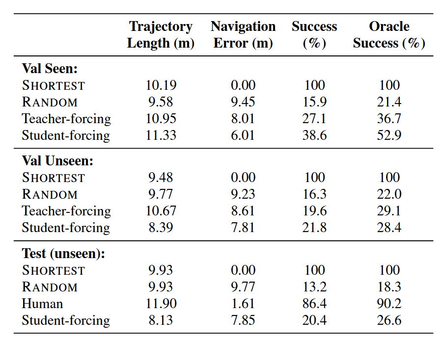
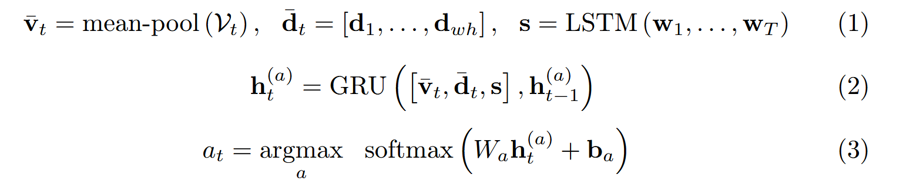
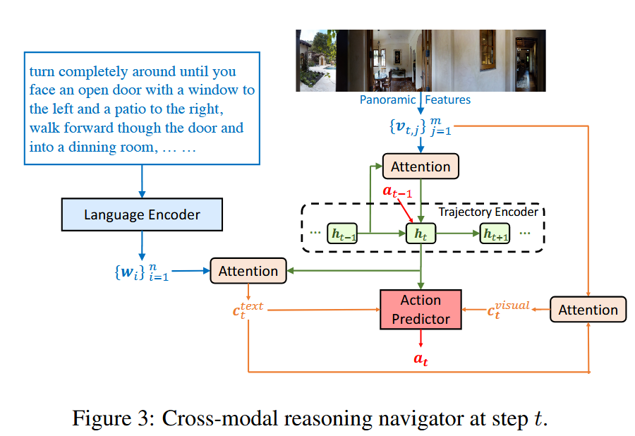
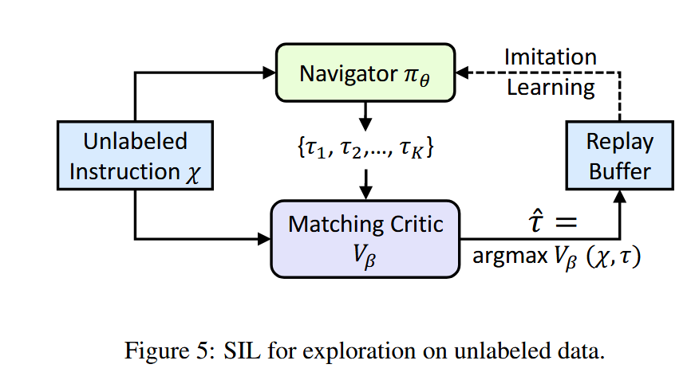

Matterport3D：提供90个场景，每个场景中的viewpoint，以及每个viewpoint上的18张RGB-D图

vln最初的论文（Vision-and-Language Navigation: Interpreting visually-grounded  navigation instructions in real environments）贡献：

1. Matterport3D simulator：为离散vln任务设计，在Matterport3D提供的viewpoint基础上生成了navigation graph G= 〈V, E〉，去除了中间穿过障碍物以及长度超过5m的边（edge）
2. R2R Dataset：基于上述图G，生成七千多条路径，每条路径用AMT标注了三次
3. agent模型：
   1. 使用注意力机制的seq2seq:encoder处理instruction，decoder将每一步的observation和上一步的action作为输入。observation使用预训练好的resnet抽取特征。
   2. 训练：
      1. 当agent在图上任何一个waypoint时，他的groundtruth-action被定义为，由该点出发到达目标点的最短路径的action。将seq2seq预测的action概率分布和groundtruth-action做交叉熵损失。
      2. teacher-forcing：只使用groundtruth轨迹上的action，这样agent就只能在groundtruth轨迹上训练
      3. student-forcing：agent使用seq2seq输出的概率分布随机选择action
   3. 结果：
      1. val seen和val unseen场景的成功率相差很大，说明模型只学习了已看过的场景，对未看过的场景几乎不具备泛化能力；换言之有很大的overfit，而且无法通过正则化解决。同时，即便在已看过的场景中，成功率也仅有40%左右。
      2. 从训练折线图上来看，只有在训练集上loss在不断减小，而在val unseen集上loss越跑越大。即使在val seen集上，loss也没有随着训练集上loss不断减小而减小，反而在震荡中缓慢上升。对此，我怀疑是agent没有explore完整个场景，有些地方还没探索到。
4. 个人总结：
   1. 从结果来看，无论是seen和unseen场景，其成功率都挺低的。从Navigation Error (m)来说，agent的误差有八九米，人类误差只有1.61m。说明离目标点都还挺远的。
   2. 论文提出的seq2seq模型，我觉得形式很优美，LSTM+ATTENTION很符合数据集特点。缺点也挺明显，模型太小，很容易overfit。
   3. 感觉teacher-forcing挺垃圾的，直接用student-forcing得了

***

分割线

***

vlnce领域开山之作：Beyond the Nav-Graph: Vision-and-Language  Navigation in Continuous Environments论文精读

#### 1.重新构建VLN-CE数据集

“MP3D also provides corresponding mesh-based 3D environment reconstructions” (Krantz 等, 2020, p. 6)，也就是说MP3D的mesh可以构建连续空间模型。

论文重建了一个基于habitat simulator的连续空间“reconstructed Matterport3D (MP3D) environments” (Krantz 等, 2020, p. 7)，然后把离散空间的waypoint映射到mesh上。然后，又把能移植的路径全移植了。最终，形成了VLN-CE Dataset。

#### 2.agent

2.1 seq2seq

最简单的一集，连注意力机制都没加

2.2 Cross-Modal Attention Model

这个就复杂不少，但是基本方法都没变

This model consists of two recurrent networks – one tracking

#### 3.一些优化的trick

感觉不重要就没看

DAgger，inflection weighting等

总结：

总的来说，感觉这篇文章最大的贡献也只是提出了vlnce，以及vlnce dataset。至于他提出的两种方法，和离散vln使用的方法变化不大，都是RNN+Attention，只是从预测high-level action改为了预测low-level action

***

分割线

***

### Reinforced Cross-Modal Matching and Self-Supervised Imitation Learning  for Vision-Language Navigation

加入了RL方法的discrete vln

#### Reinforced Cross-Modal Matching

The RCM framework mainly consists of two modules： a reasoning navigator πθ and a matching critic Vβ.

1.Cross-Modal Reasoning Navigator

注意，此模型在每个离散点上观察到的是全景图。

简单来说，就是attention+LSTM套了好几个

2.Cross-Modal Matching Critic

一个预训练好的用来得到intrinsic reward的模组

它会计算出（根据navigator目前的trajectory能反推出原language instruction）的概率，并根据此概率大小判断目前trajectory的好坏，并最终得到intrinsic reward。

#### 训练过程

训练分为两步

1.第一步是热启动过程，旨在迅速初始化agent的策略。热启动为监督学习，使用交叉熵损失。

2.第二步就是正式训练了，使用RL的方法，reward包括extrinsic and intrinsic reward。intrinsic reward使用上面介绍过的Cross-Modal Matching Critic计算得出，下面介绍extrinsic reward：

extrinsic reward也包括两部分，一是评估action使得agent靠近目标点的距离，二是评估action是否使得agent成功到达目标点周围。

最后，使用RL的REINFORCE算法，梯度下降得到最优策略。

#### Self-Supervised Imitation Learning

上述模型和训练都是基于已有数据，下面的模型将使得agent在没有数据的情况下自由探索unseen environment，并进行策略优化

SIL借用了上述Matching Critic模型。给定language instruction，agent先生成一组possible trajectories，然后由Matching Critic模型进行评估，筛选出最优的trajectory。接下来，这个最优的trajectory就被视为之前supervised learning的ground-truth trajectory，可以使用之前热启动的方法优化策略。

总结：

这篇文章实际上用了两种方法训练agent：

一种是在热启动和Self-Supervised Imitation Learning里面，使用了交叉熵损失训练

另一种是RL中的policy gradient方法，也就是REINFORCE

相同点在于，两者都使用了一样的策略函数

