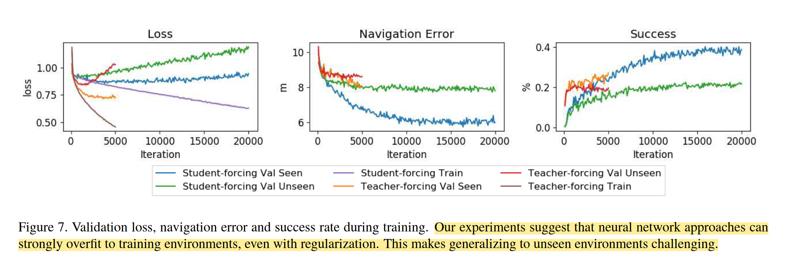

Matterport3D：提供90个场景，每个场景中的viewpoint，以及每个viewpoint上的18张RGB-D图

vln最初的论文（Vision-and-Language Navigation: Interpreting visually-grounded  navigation instructions in real environments）贡献：

1. Matterport3D simulator：为离散vln任务设计，在Matterport3D提供的viewpoint基础上生成了navigation graph G= 〈V, E〉，去除了中间穿过障碍物以及长度超过5m的边（edge）
2. R2R Dataset：基于上述图G，生成七千多条路径，每条路径用AMT标注了三次
3. agent模型：
   1. 使用注意力机制的seq2seq:encoder处理instruction，decoder将每一步的observation和上一步的action作为输入。observation使用预训练好的resnet抽取特征。
   2. 训练：
      1. 当agent在图上任何一个waypoint时，他的groundtruth-action被定义为，由该点出发到达目标点的最短路径的action。将seq2seq预测的action概率分布和groundtruth-action做交叉熵损失。
      2. teacher-forcing：只使用groundtruth轨迹上的action，这样agent就只能在groundtruth轨迹上训练
      3. student-forcing：agent使用seq2seq输出的概率分布随机选择action
   3. 结果：
      1. val seen和val unseen场景的成功率相差很大，说明模型只学习了已看过的场景，对未看过的场景几乎不具备泛化能力；换言之有很大的overfit，而且无法通过正则化解决。同时，即便在已看过的场景中，成功率也仅有40%左右。
      2. 从训练折线图上来看，只有在训练集上loss在不断减小，而在val unseen集上loss越跑越大。即使在val seen集上，loss也没有随着训练集上loss不断减小而减小，反而在震荡中缓慢上升。对此，我怀疑是agent没有explore完整个场景，有些地方还没探索到。
4. 个人总结：
   1. 从结果来看，无论是seen和unseen场景，其成功率都挺低的。从Navigation Error (m)来说，agent的误差有八九米，人类误差只有1.61m。说明离目标点都还挺远的。
   2. 论文提出的seq2seq模型，我觉得形式很优美，LSTM+ATTENTION很符合数据集特点。缺点也挺明显，模型太小，很容易overfit。
   3. 感觉teacher-forcing挺垃圾的，直接用student-forcing得了

