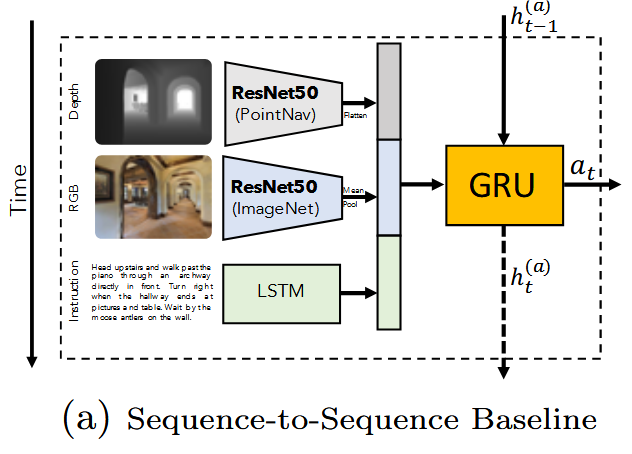
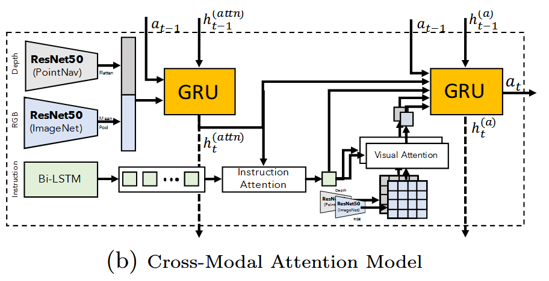
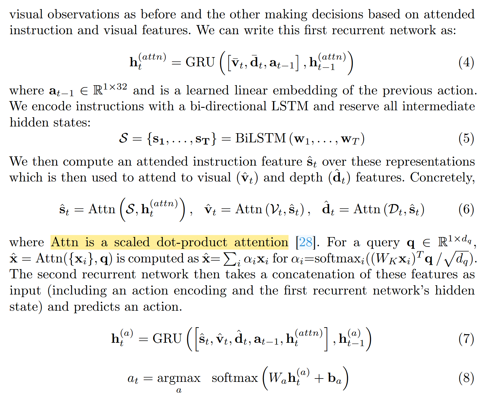

render v.渲染

vlnce领域开山之作：Beyond the Nav-Graph: Vision-and-Language  Navigation in Continuous Environments论文精读

#### 1.重新构建VLN-CE数据集

“MP3D also provides corresponding mesh-based 3D environment reconstructions” (Krantz 等, 2020, p. 6)，也就是说MP3D的mesh可以构建连续空间模型。

论文重建了一个基于habitat simulator的连续空间“reconstructed Matterport3D (MP3D) environments” (Krantz 等, 2020, p. 7)，然后把离散空间的waypoint映射到mesh上。然后，又把能移植的路径全移植了。最终，形成了VLN-CE Dataset。

#### 2.agent

2.1 seq2seq

最简单的一集，连注意力机制都没加

2.2 Cross-Modal Attention Model

这个就复杂不少，但是基本方法都没变

This model consists of two recurrent networks – one tracking

#### 3.一些优化的trick

感觉不重要就没看

DAgger，inflection weighting等

总结：

总的来说，感觉这篇文章最大的贡献也只是提出了vlnce，以及vlnce dataset。至于他提出的两种方法，和离散vln使用的方法变化不大，都是RNN+Attention，只是从预测high-level action改为了预测low-level action
